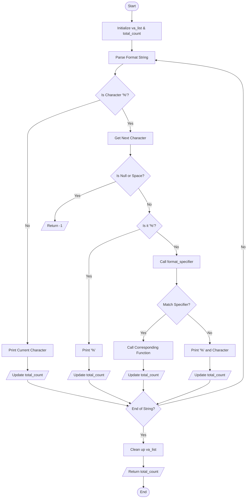

# Custom Printf Implementation

## Project Description

This project is a custom implementation of the C standard library's `printf` function. Our `_printf` function replicates the basic functionality of `printf`, handling various format specifiers to print formatted text to standard output.

Supported format specifiers:
- `%c`: Print a single character
- `%s`: Print a string
- `%d` and `%i`: Print integers
- `%%`: Print a percent sign

## Compilation

```bash
gcc -Wall -Werror -Wextra -pedantic *.c -o printf
```

## Requirements

- Ubuntu 20.04 LTS
- GCC compiler
- Git for version control
- Code follows Betty style guidelines

## Usage Examples

```c
#include "main.h"

int main(void)
{
    /* Basic string printing */
    _printf("Hello, World!\n");          // Output: Hello, World!
    
    /* Character printing */
    _printf("Character: %c\n", 'A');     // Output: Character: A
    
    /* String printing */
    _printf("String: %s\n", "Hello");    // Output: String: Hello
    
    /* Integer printing */
    _printf("Integer: %d\n", 12345);     // Output: Integer: 12345
    _printf("Negative: %i\n", -9876);    // Output: Negative: -9876
    
    /* NULL string handling */
    _printf("NULL string: %s\n", NULL);  // Output: NULL string: (null)
    
    /* Percent sign */
    _printf("Percent sign: %%\n");       // Output: Percent sign: %
    
    return (0);
}
```

## Testing

### Basic Tests
```bash
# Compile test files
gcc -Wall -Werror -Wextra -pedantic test_printf.c printf.c functions.c _putchar.c -o test_printf

# Run tests
./test_printf
```

The test program compares the output of our _printf with the standard printf function, ensuring identical behavior and return values.

Example test output:
```
Simple test
Simple test
Test 1 - Lengths: 11, 11

Character:[H]
Character:[H]
Test 2 - Lengths: 13, 13

String:[Hello]
String:[Hello]
Test 3 - Lengths: 14, 14

Integers: [123] [-456]
Integers: [123] [-456]
Test 5 - Lengths: 22, 22
```

### Memory Check
```bash
valgrind --leak-check=full ./test_printf
```

Expected output:
```
==12345== All heap blocks were freed -- no leaks are possible
```

## Flowchart



## Authors
- Edwin
- Ewan
- Frederic
```
